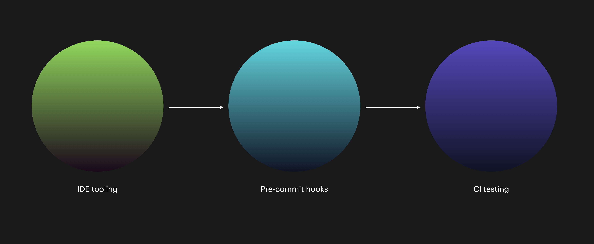

# Integrate continuously, test continuously

> **For the software delivery process, the most important global metric is cycle time**. This is the time between deciding that a feature needs to be implemented and having that feature released to users. \[...]
>
> Projects concerned with the quality of their software often choose to measure the number of defects. However, this is a secondary measure. If a team using this measure discovers a defect, but it takes six months to release a fix for it, knowing that the defect exists is not very useful. **Focusing on the reduction of cycle time encourages the practices that increase quality, such as the use of a comprehensive automated suite of tests that is run as a result of every check-in**.
>
> — Jez Humble & David Farley, _Continuous Delivery_ (p. 138)

In the last chapter, I wrote about deterministic software. This determinism goes all the way to Continuous Integration (CI) and Continuous Delivery/Deployment (CD)—often put together as CI/CD. Continuously integrating was, and is still, one of the most foundational practices of agile; without it, it's practically impossible to be agile in any real sense of the word.

## Use competent CI/CD tooling and automate all of it

A good workflow (pipeline) is fully automated, minimally cognitively complex, and puts value in people's hands as quickly and regularly as possible; often this assumes daily or several times daily. [DORA's research](https://www.devops-research.com/research.html)—also available in the excellent instant classic [_Accelerate: The Science of Lean Software and DevOps: Building and Scaling High Performing Technology Organizations_](https://www.goodreads.com/book/show/35747076-accelerate)—similarly show a high correlation between elite-performing software teams and their use of CI and [trunk-based development](https://trunkbaseddevelopment.com):

> Analysis of DevOps Research and Assessment (DORA) data from [2016](https://services.google.com/fh/files/misc/state-of-devops-2016.pdf#page=31) (PDF) and [2017](https://services.google.com/fh/files/misc/state-of-devops-2017.pdf#page=40) (PDF) shows that teams achieve higher levels of software delivery and operational performance (delivery speed, stability, and availability) if they follow these practices:
>
> * Have three or fewer active branches in the application’s code repository.
> * Merge branches to trunk at least once a day.
> * Don’t have code freezes and don’t have integration phases.
>
> — [DevOps tech: Trunk-based development](https://cloud.google.com/architecture/devops/devops-tech-trunk-based-development)

Of the [DORA metrics](https://cloud.google.com/blog/products/devops-sre/using-the-four-keys-to-measure-your-devops-performance), _Lead Time To Change_ measures the time from committing code to it being deployed to a production environment.


**Did you know...**

[Since 2021, there is also a Reliability metric in the DORA metrics](https://cloud.google.com/blog/products/devops-sre/announcing-dora-2021-accelerate-state-of-devops-report), which is maybe less known than the original four metrics.


For an elite-performing team, the _lead time to change is less than an hour_. Can you go from committed code to production in less than that? If not, I'd wager we have one or both of these general classes of issues:

* **People issues**: Such as mandated manual inspection, testing, confirmation, or similar processes such as code freeze.
* **Technical issues**: Such as suffering slow or flaky build and test automation, or not even having full automation at all.

With the focus of this book, let's turn to the technical issues.


Don't have CI/CD today, or you're still on some godawful thing from 20 years back? There are lots of good CI/CD tools these days, such as GitHub, GitLab, Azure DevOps, Harness, Bitbucket... I'm sure you'll be happy with practically any of the major modern players out there. I'm not going to go into my personal review of tooling here and now though! :joy:


The one thing in common with all CI/CD tools is that they all are scriptable and that you'll most often write a YAML-formatted file or specification that you keep with your source code. When the code gets pushed, the CI environment will pick it up and start performing its tasks according to your specification. It's not that dissimilar from scripting on any old Linux machine (you can often run other operating systems than Linux, but most commonly you'll find some Linux variant being used).


If you've never scripted a CI workflow before, [take a gander at how it might look using GitHub](https://docs.github.com/en/actions/quickstart)[ Actions](https://docs.github.com/en/actions/quickstart) which follows conventions that are pretty common among such tools.


Some of the things you should expect to see in a CI/CD pipeline could be steps for:

* Compiling code
* Installing dependencies
* Running quality and compliance tools (code quality tools, open source license checks...)
* Running unit tests and any other tests
* Deploying to any number of environments

<figure><figcaption>
Trust no single place in the build chain. Run most of the same tools, all the way from your IDE to the CI build.
</figcaption></figure>

While it's certainly possible to write really elaborate, complex CI/CD strategies, the heart of it is really about building, testing, and deploying your things. Aim for simplicity over elaboration in your CI/CD setup.

## Insist on multiple integrations and deployments per day

Once you have a good CI pipeline it's however not necessarily golden times just yet. Now comes the moment of cultural change, as you'll want to get your team to potentially change how they've grown accustomed to working for years, maybe even decades.


For more on these types of subjects, see Dave Farley's extensive set of [videos shared on YouTube](https://www.youtube.com/c/ContinuousDelivery?app=desktop). You'll find some hot takes and well-considered notions on things like Agile, TDD, and TBD.


Regardless of your overall CD strategy ([continuous delivery or continuous deployment](https://www.atlassian.com/continuous-delivery/principles/continuous-integration-vs-delivery-vs-deployment)), what you want is to minimize the code sitting idle, being outside of the production environment. The whole phenomenon of Continuous Integration insists that the code ends up in the mainline branch and that it goes to the production environment, not that it stays idle in a lower environment or on your machine.

<figure><figcaption>
Trunk based development—just a long chain of things happening after each other.
</figcaption></figure>

Besides having competent technical tooling available which you can trust and rely on, you'll want to feel confident in your code not behaving incorrectly. No surprise: Test automation is the best way to do that. **Testing your code often is a well-established way to know that your code and tests are well and truly exercised**. By minimizing the time between commits you will end up with, relatively between two adjacent commits, a smaller set of changes at play in each instance. While a change, large or small, can be breaking it's usually true that **bigger changes create more surface area for something to fail**. Infrequent and big commits lead to more problematic code—just go ahead and start pushing small commits frequently! Don't forget to run all the tests every time while you're at it.

## In summary

In closing, view anything that hinders your team from integrating and deploying as often as possible as a tangible, clear risk to your quality and delivery.

Going from traditional and often problematic ways of doing CI/CD is not always easy, and you'll have to be a good leader if you're the one taking your team from such a state to CI/CD nirvana.
