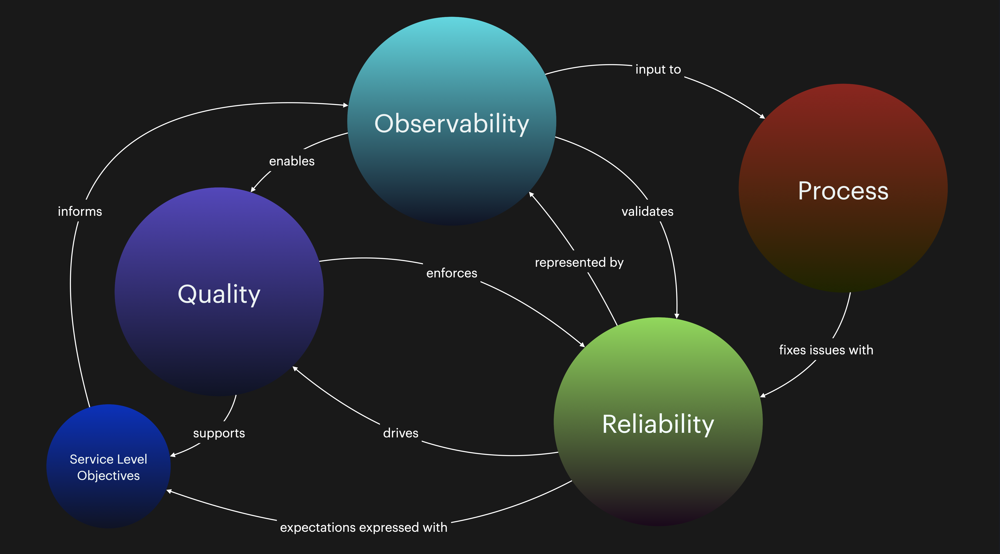

# What our "good" looks like

> Insanity is doing the same thing over and over and expecting different results.
>
> — Albert Einstein (supposedly)

Software engineering is such a big business that we today seemingly have more people talking _about_ software than actually making anything—that's unfortunate because it also starts eroding qualitative engineering practices. We are starting to have relatively young engineers thinking you _can't_ have agile, continuous deployment, trunk-based (not PR-based!) workflows, and 100% test coverage. That's ironic, as these qualities have been addressed in the literature for more than 20 years! Not to mention they are highly present in "real" software companies, that are actually creating bottom-line results thanks to their software products. Still, in most companies, we see a division between IT and business and we see project managers (rather than true-bred product owners) driving one-time deliveries (rather than iteratively engaging with long-living products) on timeframes unknown to key stakeholders within technology departments, leaving a great big mess of it all.

Experiences like these tell us quite clearly that **bad practices often come from people least knowledgeable in efficient and qualitative software delivery—not the other way around**.

In this chapter, I'll present some of the ways you can start setting standards for your software delivery and tests, as well as how to think in the team.

## Getting unstuck from the tyranny of local optima

I'll be the first to recognize I'm not a "numbers guy" but I like the general concept of _local_ and _global optima_. Wikipedia explains it:

> In applied mathematics and computer science, a local optimum of an optimization problem is a solution that is optimal (either maximal or minimal) within a neighboring set of candidate solutions. This is in contrast to a global optimum, which is the optimal solution among all possible solutions, not just those in a particular neighborhood of values.
>
> — Wikipedia: [Local optimum](https://en.wikipedia.org/wiki/Local\_optimum)

Let's consider a completely fictional diagram of how some of our software releases might have turned out in terms of bugs, issues, team satisfaction with the release, and the amount of technical debt we accumulated to release the new features. It might look something like this:

<figure><figcaption>
Local vs global optima. Adjusted from <a href="https://peachturnspro.wordpress.com/2016/04/19/stuck-in-a-local-optima/">peach turns pro's article</a>.
</figcaption></figure>

In this diagram, we find two releases that were above our expectations, which hopefully were conclusively and concretely outlined in our _definition of done_ so that this is not just some random set of feelings we happen to have at the moment. Unfortunately, we also have seven releases that are _below_ our level of acceptance—yet they had to be released and subsequently were so.

In the total view, **one release went beyond our maximum capability**, which is to say what we think/know our team is _capable_ of producing and this particular release (our "best" release) therefore marks our _global optimum_. In the first half, however, we have a release that wasn't "as good", but which was the best in that window of time. The maximum capability is a dynamic value that changes depending on the team, circumstances, pressure, backlog, technical debt, and other external variables.


Working "harder" or "faster", or simply typing faster, will never make you more efficient. It's the wrong end of the problem space.


So, what do I mean by the "tyranny" of local optima? It means that it's easy to get complacent because we had that "one big win", or that we start believing that there is a God-given trajectory for our progress: In fact, it can always go up or down! It's about not being blinded by historical precedent or accepting the current level, and persisting with grit on a trajectory that goes upward over time. Feel free to high-five each other every now and then, but don't forget to zoom out—can we do even better? Are we even at our best, in-total, competitive level right now?

Being stuck in the local optimum is similar to analysis paralysis or other passive states we may find ourselves in—like being in rigor mortis but for a whole team or organization! For example, we might be expending _a lot_ of resources on manual testing to just barely scratch the acceptable level. Because we fear that any change will make us tumble back down, we fear change and we avoid it at any cost. We accept the current state even as we may be well aware that our maximum capacity is a lot higher.

What you probably really want is to **consistently perform at the top of your game**, and do so consistently at the top of your maximum capability. In that case, a local maximum in the middle area won't be enough.

Therefore you will need to depict, with no lack of detail, the _delta_ between where you are today and the improved, future state.


Not tracking your team's performance and delivery? Then you might be interested in tooling or methods that could be introduced, such as:

* [SPACE metrics](https://queue.acm.org/detail.cfm?id=3454124), a semi-followup to the DORA metrics but has more and broader categories
* Tools like [Swarmia](https://www.swarmia.com) or [Cortex](https://www.cortex.io)
* Conducting activities like retrospectives and surveys to get input on "how we are doing"



Create some accountability for yourself, your team, and any managers. Every change is a kind of investment. Given "market conditions" an investment may or may not pay off, and it may not be clear when that pay-off happens. That doesn't mean you can't set up a clear idea of what the future state should _ideally be like_ at a given point in the future.

Ask these stakeholders:

* If not us, then who?
* If not now, then when?
* If not for this (particular pay-off), then for what?


The resource constraints we typically have in software engineering come down to **time** and **competency**. The unfair reality is that a highly-skilled software engineer could potentially automate away several tester jobs in less than a day of work. This is not an ethics contest—**what we want is automation**. If the initial investment (and work) is done competently we will eventually get some results from that investment—hopefully, this is time. While increased competency is good—as we can use it to, for example, do certain tasks better and/or faster—time is something we can _invest_ in something. Competency helps us _perform_.

If you don't have the required competency then you can deal with it in at least two basic ways:

* Hire someone who can assist with the automation (or whatever the work in question is)
* Upskill your team and assign them work that actively makes them more competent

To overcome the local optima fixation we must aim to _continuously exceed the maximum capacity we believe we have._ You can't do this without changes of some kind.


Remember Einstein, "Insanity is doing the same thing over and over and expecting different results".


The flip side is that over time you will more easily be able to exceed the capability if your team is actively _learning_ how they can minimize time spent on less-important activities. Everyone who has ever trained or been working out knows that the biggest hurdle is at the start...then suddenly you are running 10Ks easily, just for training!

## Build better without more resources

I guess one of the big questions many of us building software in the impure reality of companies that need to build software to compete (but would much rather not build software at all) and do not have engineering-centric leadership is "How on earth will we support _better_ deliveries when we barely get by today?".

I believe the answer must include a strong sense of mission (unity, purpose) as well as a rock-solid core around automation:

* **By adjusting or even totally dismantling manual processes and handovers we **_**create**_** time where none existed before**. You'll be hard-pressed to find any manager that will suddenly, out of thin air, invent a new time for you. Suck it up and start creating the possibilities.
* By continually feeding a quality-aware culture we **make everyone a stakeholder of the quality**. How do we do this without awareness or intentional changes in how we deliver? You don't; it will end up being one person burning up when it has to be a team effort. No one is too "small" to aid in delivering towards common quality goals.


Some companies and cultures might be too broken to fix. If that's truly the case, well _c'est la vie_, as a software engineer you'll find a new job quickly if you decide to pull the plug. Don't bleed for your job. :beach:


Use machines to do machine work that no human should do. Let it run the tests, lint the code, scan for security issues, package and deploy your artifacts, and whatever else you can think of.

## Pulling out the yardstick

While there is practically an entire science around how to measure software engineering performance, with [DORA becoming a household name](https://www.devops-research.com/research.html) and the [Accelerate book](https://itrevolution.com/product/accelerate/) being a must-read for any engineering manager, it's safe to say that in the early 2020's the [DORA metrics](https://www.cortex.io/post/understanding-dora-metrics) reign supreme as one of the primary metrics sets we can use.

The four DORA metrics are:

> * **Deployment Frequency**—How often an organization successfully releases to production
> * **Lead Time for Changes**—The amount of time it takes a commit to get into production
> * **Change Failure Rate**—The percentage of deployments causing a failure in production
> * **Time to Restore Service**—How long it takes an organization to recover from a failure in production
>
> — [Google Cloud Blog](https://cloud.google.com/blog/products/devops-sre/using-the-four-keys-to-measure-your-devops-performance)

Though perfect metrics do not exist, these particular ones do tend to show that high DORA scores can only realistically be attained by teams who work with modern practices. Elite-performing teams meet the highest DORA marks by combining both speed, quality, and stability:

> * Release many times per day.
> * The lead time for changes and moving into production is less than a day.
> * The time to restore service is less than an hour (low performers take between a week and a month).
> * The change failure rate is zero to 15%.
>
> — The New Stack: [_Google’s Formula for Elite DevOps Performance_](https://thenewstack.io/googles-formula-for-elite-devops-performance/)

The below diagram summarizes very well what goes into transforming into a high-performance organization and thus driving the metrics up. You'll see on the left side that we have more than a dozen technical practices that, in total, lead to continuous delivery, that correlate to positive effects such as less rework and burnout.

<figure><figcaption>
Image from <a href="https://cloud.google.com/architecture/devops/devops-tech-continuous-delivery">Google</a>.
</figcaption></figure>

Now we can start to plan from the end goal, rather than from the "start" to some unclear final destination. If we want better organizational performance we see that we should implement, among other things, these technical practices. Starting with updating our practices is a smart thing as it's actionable, collective, and affects the actual work, rather than the management or "performing" and ritualization of work (e.g. sitting in meetings, doing stand-ups, and similar).


The book you are reading is about testing so I'll keep it relatively clean here, but we can see that testing is just one of many parts that might need changing to fully transform the circumstances in your organization.

For the context here, I will refrain from any additional mention of core practices such as version control, empowered teams, and several of the other practices as they stretch the scope a bit too much. I highly recommend reading [Google's materials on DevOps](https://cloud.google.com/architecture/devops/devops-culture-transform) to appreciate the many things that go into being a high-performing technology organization.


You can certainly track DORA performance over time, but a quick and painless first start would be to do the [DORA Quick Check](https://www.devops-research.com/quickcheck.html) every month to see what the current (experienced) state is. While less scientifically correct than having those calculated based on actual work being done, it should set you in the correct half of the chart at least.

We now have an understanding of practices being correlated to performance, and that we should focus on the things relating to testing. So what would a fuller picture tell us, so we can visualize for our inner eye the end state of our work?

### What we want

If we only look at our testing concerns, then our ideal scenario which would go high on the DORA metrics and tick many of Google's technical practices boxes would be something like this:

* We have a pipeline that is fully automated and minimally cognitively complex.
* We can always push code to the pipeline and it will run and complete in less than 10 minutes.
* We are confident in our code and that automated tests catch all potential issues that _we know are not according to expectations_.
* We are "testing in production" and catching (alerting etc.) any issues that are _outside of expected or known boundaries_ (manual or AI-assisted thresholds).
* We have built observability into the state of our software, so we can easily understand what went wrong (and for who) if there is ever an incident.
* We have described in our definition of done what is expected of a unit of work to conform according to our standards, and for it to fulfill the above ideal scenario.

That's a pretty concrete vision of how we'd perhaps want our future state to be. By taking the individual steps in writing (formulating the definition of done) you can help make sure that activities are performed and done to a required level that will move you and the team to that ideal scenario with less fuss and a greater sense of purpose and clarity.

## Pushing for change

Lastly, let's end with some other concrete things your team can do.

Understand that optimal circumstances will never organically exist; you need to work on creating them. Under which conditions would the team make their best work?

Some ideas might be:

* **Requirements are poor**. We will write and provide a better form that sets directions we need to have considered for our requirements or design proposals.
* **Our definition of done does not include testing**. We'll put testing as a requirement and ensure that all pull requests have tests included.
* **Test automation efforts are going too slowly**. We are going to add a minimum coverage threshold to our CI pipeline starting next month, creating an internal goal and pressure to have this in place.
* **We are writing too many brittle tests**. Therefore we will spend some time inspecting which parts of our codebase might be too coupled and "untestable". We will skip these tests for now and use that time to improve the root causes, by refactoring the code and writing better unit tests.
* **Our manual testers don't provide enough value**, but they are happy to start doing test automation for certain test types so we'll give them time to learn and then write tests starting next week.
* **We have too many meetings affecting most of the team**. We will have meetings only between 8:30am and 10:00am to encourage having dedicated and uninterrupted "flow time" after 10am.

<figure><figcaption>
To reach qualitative software, it will have to be a whole-team effort, and it won't involve just testing.
</figcaption></figure>

What factors are not in your hands? What does need to be addressed to someone else, and if so, who is that?

Discuss and agree on what these things might be. Communicate them to others. Make it so.
