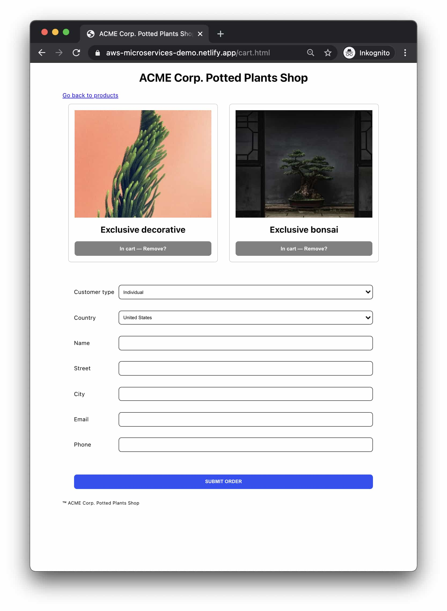

# Front-end application


**Scenario**

Our team is building a new web application (front-end) for a small client. We've been granted access to the previous iteration written in another language; it's good enough for us to understand generally what we need to do for the back-end integration.

**Testable surface**

Web front-end.

**Code access**

First-hand access to front-end code and any new integrations; no access to existing back-ends or APIs.



**Proposed approach**

Write key user flows as E2E tests.

Separate front-end logic into unit-testable functions and write snapshot tests for UI components.

Send integration errors to an APM service with alerts to our business stakeholders and our technical team.&#x20;


This scenario will push nerves a bit because it will feel antithetical to much of what I've written in this book. Fear not, we will make the best of it!&#x20;

In a front-end team, we tend to control a lot less of our circumstances. Still, as you've read before, we need to be crystal clear in our boundaries: I don't want to test _your_ things! The same goes for you: There should be no need for you to test the packages, modules, or APIs _I've_ provided you with.

Alas, the reality of our front-end application is that it is by nature a "dirtier" thing than a pristine back-end. Not because I like it less—not at all!—but simply because it has to cobble together and use an array of services and whatnot to work at all. In the back-end world, we can talk, something dismissively, about "integration", yet no one talks in such illusive terms about setting up the Stripe API in a web application.

I believe we can sense a basic maxim at play:

> You wouldn't test third party code (so don't).

Or in similar terms...


"You wouldn't steal a car?"



Yes, I am old enough to remember this clip being rolled in the pre-movie trailer section of VHS tapes. Remember those?


So with that long digression out of the way: Why would you test someone else's code, even if it's that written by the friendly team down the hall? Don't.


This example uses the [microservices testing workshop](https://github.com/mikaelvesavuori/microservices-testing-workshop) codebase.


## Start with cleaning up, then introduce unit tests and static code analysis

A great place to start is to ensure that the code is in ship shape.

If you are using a **pure vanilla stack** (and I do literally mean HTML, CSS, JS) then you will have a _very clean_ baseline to work with. Of course, with a higher degree of flexibility comes a requirement for more mastery of the principles. You could consider for example rigorous [BEM naming conventions in CSS](https://getbem.com/naming/), [super-tidy JavaScript](https://github.com/ryanmcdermott/clean-code-javascript) (maybe even a functional programming style), a hexagonal/[Clean architecture](https://khalilstemmler.com/articles/enterprise-typescript-nodejs/clean-nodejs-architecture/) style (folders, etc)... Fewer guardrails give ultimate freedom; intoxicating but dangerous in the wrong hands! While it may sound archaic to some to revert back to these core basics, it's actually not too dissimilar from other "rawer" approaches like [Svelte](https://svelte.dev) or [Alpine.js](https://alpinejs.dev). There's definitely some kind of resurgence in this general area.

With this approach, I would argue it's clearer how you write clean code and any requisite tests. Just write them! Always make sure your code and tests on the local level are watertight and of good quality.&#x20;

In a framework-driven and more conventional setting, such as if you are using a freer and less opinionated one like React, then you can stay vigilant on not polluting functions with business logic. Instead, separate complicated or complex functions into smaller, testable bits. Consider the easiest and rawest option as generally the best option: Functions over hooks, for example. There's tons of good reading and advice on this (and some bad), but I can recommend following [Nik Sumeiko on LinkedIn](https://www.linkedin.com/in/niksumeiko/) as a start if you're a React developer.

Introduce static code analysis tools as well, such as ESLint and Prettier, while you are at it.

Visual snapshot tests might be relevant as well, depending on the volatility and complexity of our project.

## Checking the full flow (or as much of it as possible)

Given that we control none of the backends our most reasonable hope, based on the likely composition of our team, is to add end-to-end tests. Integration tests and contract tests won't be of any real use to us here, unfortunately.

<figure><figcaption>
Our end-to-end flow could check that external features work as intended. Pure logic should already be covered in unit tests, as always.
</figcaption></figure>

Before doing so, we need to check if we have testing endpoints or are allowed to create test transactions so that we know whether or not it's OK that our flow actually goes all the way, or if we need to stop short of that.

<figure><figcaption>
Is it OK to submit our test order? Before continuing we need to know what to do about side effects.
</figcaption></figure>

## Errors need to go to some tool

It's advisable that all errors are passed to some tool, for example, an Application Performance Monitoring (APM) tool such as [Sentry](https://sentry.io/welcome/). The less control we have, the more we should treasure any feedback we get—especially the negative ones, such as actual errors! This will help us know if integration errors occur for our customers since we (yet again) don't control any of the other systems ourselves.

Missing out on implementing this capability in our current circumstances will make us blind, so make sure to add one.

We could also combine some basic synthetic testing with our APM tool to feed data to us before we have a handle on the real user traffic.
