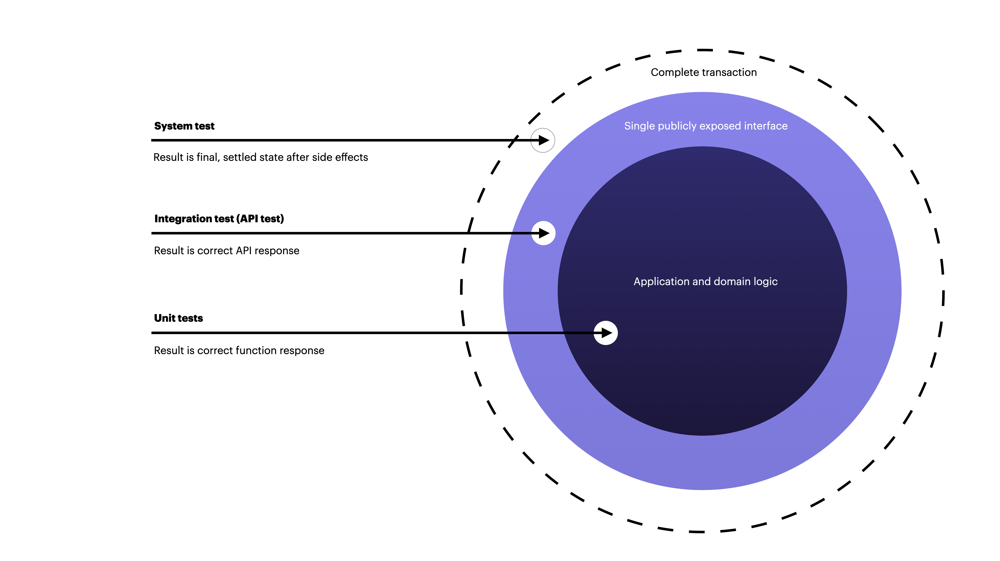
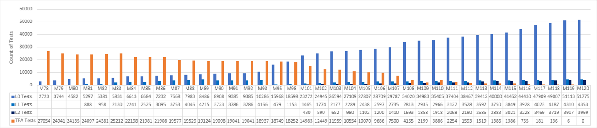

# Prefer fast and reliable: On unit vs integration testing

> Tests create a feedback loop that informs the developer whether the product is working or not. The ideal feedback loop has several properties:
>
> * **It's fast**. No developer wants to wait hours or days to find out if their change works. Sometimes the change does not work - nobody is perfect - and the feedback loop needs to run multiple times. A faster feedback loop leads to faster fixes. If the loop is fast enough, developers may even run tests before checking in a change.&#x20;
> * **It's reliable**. No developer wants to spend hours debugging a test, only to find out it was a flaky test. Flaky tests reduce the developer's trust in the test, and as a result flaky tests are often ignored, even when they find real product issues.&#x20;
> * **It isolates failures**. To fix a bug, developers need to find the specific lines of code causing the bug. When a product contains millions of lines of codes, and the bug could be anywhere, it's like trying to find a needle in a haystack.&#x20;
>
> So how do we create that ideal feedback loop? By thinking smaller, not larger. \[...]
>
> With end-to-end tests, you have to wait: first for the entire product to be built, then for it to be deployed, and finally for all end-to-end tests to run. When the tests do run, flaky tests tend to be a fact of life. And even if a test finds a bug, that bug could be anywhere in the product.
>
> Although end-to-end tests do a better job of simulating real user scenarios, this advantage quickly becomes outweighed by all the disadvantages of the end-to-end feedback loop.
>
> — [Google Testing Blog: Just Say No to More End-to-End Tests](https://testing.googleblog.com/2015/04/just-say-no-to-more-end-to-end-tests.html)

In this chapter, we will relate unit tests and integration tests and I will argue for preferring unit tests over integration tests.

OK, so what are some properties of a unit test?

* A unit test is anything that does not reach out to other services, systems, or I/O.
* A unit test can test _any scope_ within the same system: A complete use case or a particular error in a specific function. The consequence is that a unit test _is not tied 1:1 to a given class or function unless that's what you want_. They can be as exact as you want and need.
* To gain high levels of test coverage, you will have to write all wide ("acceptance" or use case) tests as well as fine-grained function/class-oriented tests.
* There should be no reason to mock a lot at all (if anything) since unit tests do not use other systems. It's advisable to mock as little as possible since doing so adds complexity, frailty, and a decoupling of the test/mock and the actual implementation making it less confidence-building.

And integration tests...

* An integration test is anything that actually does use real services, systems, or I/O.
* Integration tests are "black boxed" higher-level tests that test for expected behavior, but do not add detailed feedback on its execution or "under the hood" operations.
* To be clear, integration tests use real infrastructure whereas unit tests do not require any at all.
* Question your need to test on infrastructure and drive towards unit tests until it doesn't make any sense.
* Use real infrastructure if you need to actually see if something works.
* Side effects of integration tests may or may not be persisted, but they must always be controlled.

<figure><figcaption>
The further out we are, the more is in the scope of a test, yet, the less we know about what happens on the inside. Also, the further out we are from the code, the more expensive and slow it is to run our test.
</figcaption></figure>

## Understand and question your goals with testing on infrastructure

What are your goals with integration testing, is it to use infrastructure to gain some confidence you are looking for? A part of your testing strategy and/or model should be to determine what types of tests and proportions you aim for. It seems that it's getting increasingly popular with integration testing in such models; however, you will remember I only attributed a small part to it, myself.

Some of the benefits of testing with actual infrastructure include:

* That it's closer to the "actual" performance and state.
* Feedback from such testing should be of a higher quality, being more truthful.
* It can smoke out errors in integration logic.
* It makes it possible to understand if our configuration is incorrect (such as not being able to send a message on an event bus because we don't have proper access rights to it).

In fact, many of the above issues can be caught already with good unit tests and solid static analysis and types. What cannot be caught can be, to a large extent, substituted. How many integration errors are not actually your application-side errors?

With this said, _there is a need_ for some integration testing, but try to push it to those points of your software where you can't meaningfully catch them with unit tests. I've found the best way to use integration tests as a small selection of very precise "acupuncture needles" to see that things hold together like expected, closer in spirit to smoke tests.

You need to think of _your goals_ of testing with infrastructure, given that it's heavier, more expensive and time-consuming, and more of a hassle to test. Question and pressure-test your assumptions. Do you already have good unit test coverage? Do they cover the steps that produce data for outbound integrations? Are you validating, sanitizing, and cleanly handling input data?

As a developer (or architect) you should always aim for [supple design](https://opus.ch/ddd-concepts-and-patterns-supple-design/), and in keeping with [Occam's Razor](https://en.wikipedia.org/wiki/Occam's\_razor), prefer the simplest answer. **In other words, prefer unit tests**. Even tech giants like Microsoft have been through this battle and have reaped significant benefits as a result:

> A Microsoft team decided to replace their legacy test suites with modern, DevOps unit tests and a shift-left process. The team tracked progress across triweekly sprints, as shown in the following graph. The graph covers sprints 78-120, which represents 42 sprints over 126 weeks, or about two and half years of effort.
>
> The team started at 27K legacy tests in sprint 78, and reached zero legacy tests at S120. A set of L0 and L1 unit tests replaced most of the old functional tests. New L2 tests replaced some of the tests, and many of the old tests were deleted.
>
> — [Microsoft: Shift testing left with unit tests](https://learn.microsoft.com/en-us/devops/develop/shift-left-make-testing-fast-reliable)

<figure><figcaption>
From <a href="https://learn.microsoft.com/en-us/devops/develop/shift-left-make-testing-fast-reliable">https://learn.microsoft.com/en-us/devops/develop/shift-left-make-testing-fast-reliable</a>
</figcaption></figure>

The Microsoft team drove down test time and increased the reliability of tests over the two years it took to migrate their significant collection of non-unit tests. Notice how few non-unit tests persisted once their transformation phase was over?


Overall, you'll find plenty of advice about maximizing the use of unit tests in the literature as well as in good online sources. For more, see the `Reference and resources` section at the end of this book.


Boil down the surface area of your tests — I am sure you will see that integration tests are less needed than you thought they were at first.
