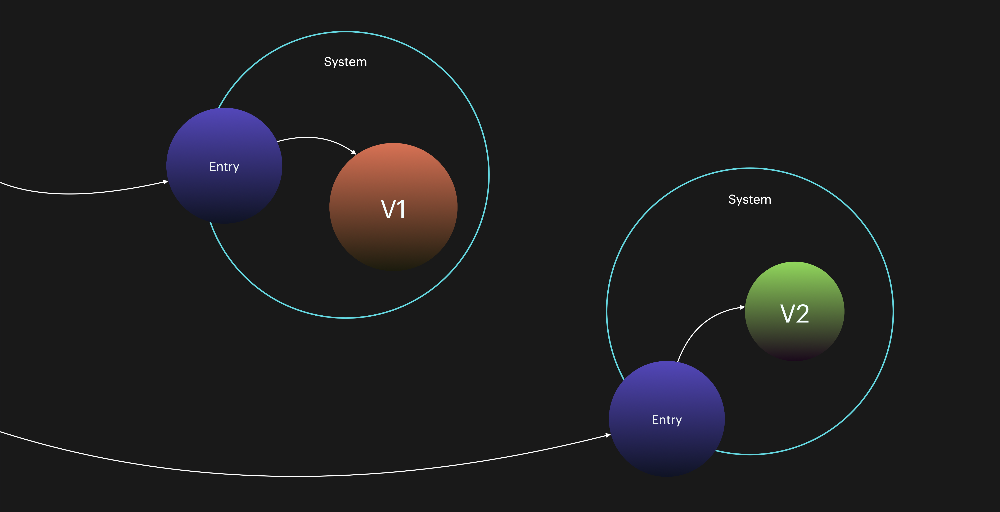
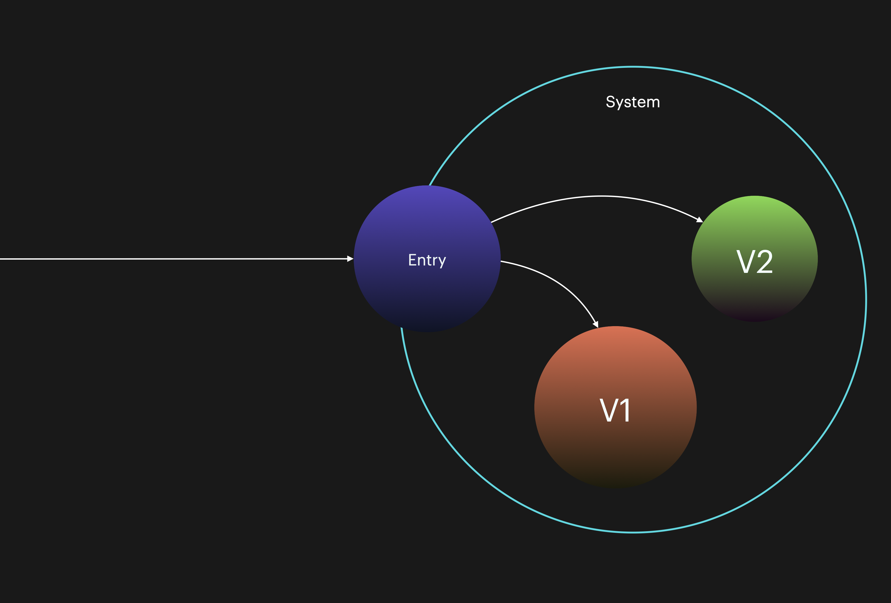
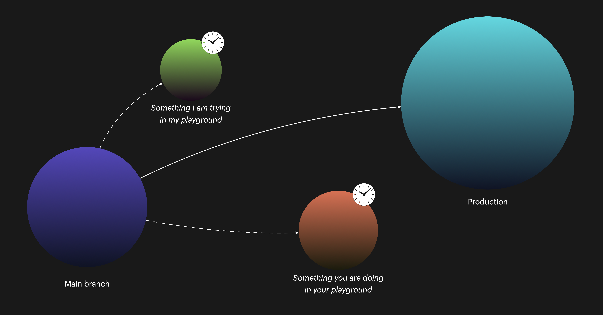

# Test environments

> what if... the best "staging area" was just running in prod, but for corp users only?  or for your free tier only?  or for an opt-in set of users only? 
>
> — [Charity Majors](https://twitter.com/mipsytipsy/status/1050316279968481280)

Get ready for what might be some controversial points, if not for you, then maybe for your team or organization!

A commonly held orthodoxy is that you need a test environment – an environment that acts as a stand-in for running your tests, so that any spill-over effects from your testing, and potential failures, won't affect your actual, real users. Testing environments are supposed to root problems that we can't see locally. It's a solid idea, but one I find wherever I've been, to be fundamentally dysfunctional for some of the same reasons why separating developers and QA is a misleading idea.

Let us start by unpacking three underlying assumptions: _impact_, _location,_ and _longevity_.

## What is the impact of a caught, or uncaught, issue?

Not every bug or issue is world-breaking. Do you have clear and known ways to measure and prioritize the scope of an issue?

Finding bugs in testing is a good thing, but not having any issues at all is of course even better. By aggressively pushing left on tests, making developers write them to a high coverage and quality bar, running them often, and generally being mature about our testing, we are mitigating the _escape rate_ of issues that others will experience.

However, not every issue will or can be caught up-front, because the total surface of your solution is not only the code you wrote. Shifting left on tests should reduce, but cannot totally remove, the surface area of potential issues. Using a test environment offers us a framework to detect these lesser-known issues. Similarly to system tests and integration tests, however, using a full test environment for the class of issues we already know about makes no sense, adding only complexity, cost, and unnecessary procedure.

**The impact and class of an uncaught issue should help guide somewhat whether a test environment, in any form, is needed**.

## Where do we run the tests? Splitting either by hardware or software

The testing environment concept is often highly tied up with a notion of being a separate environment in terms of hardware, meaning the code under test is deployed to some other piece of hardware than where it will run for any real users. Hence, we might call this a _hardware-segregated environment_. The location is different from where your real code will run.

<figure><figcaption>
Typical hardware split. Each URL goes to a completely different system and set of circumstances.
</figcaption></figure>

This is what ultimately ends up being your `staging.org.com`  and `prod.org.com` fully-qualified DNS names, and is a notion grounded in older times when doing redirects or traffic shifting was either not possible or it was hard.


Some tooling, like Cloud Run, [can handle such things without any additional networking configuration](https://cloud.google.com/run/docs/managing/revisions).


Another option would be to run tests on the exact same hardware but distinguish the testing code by software means, for example by letting [feature flags](https://martinfowler.com/articles/feature-toggles.html) and/or in combination with identifying HTTP headers and [branching by abstraction](https://www.branchbyabstraction.com) in the code decide that you will run against the new, testable code.

<figure><figcaption>
The application is deployed on a single piece of hardware and dynamically uses relevant code paths.
</figcaption></figure>

This is now a _software-segregated_ test environment instead. In this reality, will only therefore only use the `prod.org.com` DNS name.


Ideas for how to get the correct identity and feature set:

* Explicitly passed `Authorization` header and/or OAuth token, etc.
* Custom headers, like `X-Client-Version`.
* Presence of automatic edge-side headers and metadata; see for example [Cloudflare](https://developers.cloudflare.com/fundamentals/get-started/reference/http-request-headers/)


## What do you think you are gaining from testing on separate infrastructure?

Given that it's neither more truthful, correct, faster, cheaper, easier, or better scaling, then why do we still keep reverting to this notion of the separate test environment?

One technical reason might be **infrastructure performance reasons**. Given your context this may be valid: Say you run a very small database instance for your production traffic (which is overall light) but have aggressive testing protocols. Hammering the database could therefore realistically worsen the user experience. It's impossible for anyone, let alone me writing an e-book, to say what is the _right thing for you to do_ but I can point out a few factors you should consider:

* **Prioritize quality**: What if your testing efforts would emphasize quality over quantity? There is no correct number for tests, of course. Also, if we rebalance the types of tests we want to conduct to use more unit tests, then as a consequence of that, we also want to mock using real infrastructure, lightening the load on the infra.
* **Balance effort better**: What is the balance between actual use and the rigor of testing? In the above scenario, there was low traffic but an inordinate amount of heavy testing traffic. The balance doesn't seem right given the effort of testing something that is only lightly used.
* **Infra is under-provisioned**: The infrastructural setup might need to improve given that you can't even take a slight bit of increased load without it causing heart palpitations. Consider auto-scaling alternatives or even serverless options for future improvements.

So far we've seen that it's not impossible to put the performance argument to rest. In your common non-[MANGA](https://www.reddit.com/r/csMajors/comments/qhtqre/faang\_manga/) scenario it seems to rest on a broken strategy, rather than being a valid argument.

There could also be **compliance reasons** for why you would rather not test on the same infrastructure. It might be well worth discussing with your auditors if they are not OK with same-infra testing if you fulfill the same separation of data access and other such factors they might require of you. I've been in such conversations and auditors will typically open up for this if there are other guarantees in place. Don't mix up the auditor's job with yours! Target the wanted outcomes rather than being technology-centric.

Don't lose sight of the explosion in complexity when you run traditional hardware environment splitting:

<figure><figcaption>
Yeah, I was never the math guy, but that would be my take on a formula. The "Current" refers to the current norm of <code>DEV</code>, <code>STAGING</code>, and <code>PROD</code>. The worst thing? You still have no control over anything outside of your own system!
</figcaption></figure>

Running a single, or at least fewer permanent environments, is a really good idea.

## Use infrastructure-as-code to keep environments exactly as configured and as similar to each other as possible

Another major testing problem that many developers face, is having flaky environments: something that worked in X no longer works similarly in Y. It's not uncommon that this is especially common in IT landscapes where we lack automation for deploying and maintaining the infrastructure.

Terraform, Serverless Framework, CDK, and many other tools allow specifying, configuring, and deploying infrastructure with such automation capabilities. As far as possible, migrate or at least start using tools like these to deliver infrastructure "on tap", without drift, reducing the number of those situations. These tools make it much easier to ensure that an environment is strictly configured the same as another environment.

Regardless of your stance on software or hardware-segregated code, using IAC will make your life easier and give meaningful improvements on the stability of any environment, testing or otherwise.

## Set up unique test environments for each system

Instead of sharing an environment, have a test environment that is unique to each system, minimizing the blast radius of issues, which better separates systems, as well as communicates that each system has its own lifecycle rather than some implied shared lifecycle. Allowing another system (or client/customer) to stall development and releases is anathema to agile development.

## Benefit from the upsides of using ephemeral environments

We have started to look at the _location_ aspect of environments—now we will turn to the _longevity_ aspect.


**A long-lived shared environment** in this context means a classic _long-lived_ environment, typically something like `DEV`, `STAGING`, `QA`, `TEST`, and `PROD` used by all products that share that lifecycle.

**Ephemeral** (temporary) in this context means a short-lived environment. It may be _actually short-lived_ in which case all of the environment's infrastructure is created and destroyed as a direct consequence of, for example, testing.


It may also be handled in a way in which the testing infrastructure is uniquely owned and retained over time (though never shared across products!) but is never exposed for integrated co-dependent testing as is typical for static testing environments.


We will assume IAC (infrastructure-as-code) tools like CDK, Terraform, or Pulumi are being used in both scenarios.

We will, likewise, assume that two different team setups may be handling the respective solution (see the table).


Below, I will outline some of the properties of long-lived vs short-lived environments and how they stack up against each other.

| Effect                                                                      | Long-lived shared non-production environment                              | Ephemeral non-production environment                                                          |
| --------------------------------------------------------------------------- | ------------------------------------------------------------------------- | --------------------------------------------------------------------------------------------- |
| **Ease of deployment**                                                      | -                                                                         | -                                                                                             |
| For Ops/Infra/Platform teams                                                | <mark style="color:red;">More complex</mark>                              | <mark style="color:green;">N/A</mark>                                                         |
| For application/product teams                                               | <mark style="color:orange;">Somewhat complex</mark>                       | <mark style="color:green;">Easy</mark>                                                        |
| **Ease of managing environments (drift, configuration etc.)**               |                                                                           |                                                                                               |
| For Ops/Infra/Platform teams                                                | <mark style="color:red;">More complex</mark>                              | <mark style="color:green;">N/A</mark>                                                         |
| For application/product teams                                               | <mark style="color:yellow;">Low to medium complexity</mark>               | <mark style="color:green;">Easy</mark>                                                        |
| **Ease of use**                                                             |                                                                           |                                                                                               |
| For application/product teams                                               | <mark style="color:green;">Easy, segmented on the DNS (URL) level</mark>  | <mark style="color:green;">Easy, segmented by dynamic factor (headers, identity, etc.)</mark> |
| **Ease of testing**                                                         | <mark style="color:green;">Easy</mark>                                    | <mark style="color:green;">Easy</mark>                                                        |
| **Confidence of testing**                                                   | <mark style="color:yellow;">Variable</mark>                               | <mark style="color:green;">High</mark>                                                        |
| **Opportunities**                                                           |                                                                           |                                                                                               |
| Supports canary releases?                                                   | <mark style="color:green;">Yes</mark>                                     | <mark style="color:green;">Yes</mark>                                                         |
| Supports fast release cadence?                                              | <mark style="color:green;">Yes</mark>                                     | <mark style="color:green;">Yes</mark>                                                         |
| Enables independent deployability?                                          | <mark style="color:yellow;">Yes, but can be hijacked</mark>               | <mark style="color:green;">Yes</mark>                                                         |
| Offers more lifecycles than the fixed, provided ones?                       | <mark style="color:red;">No, not without special treatment</mark>         | <mark style="color:green;">Yes</mark>                                                         |
| Enables high agility?                                                       | <mark style="color:orange;">Not if dependent on Ops/Infra/Platform</mark> | <mark style="color:green;">Yes</mark>                                                         |
| **Risks**                                                                   |                                                                           |                                                                                               |
| Inadvertent side effects if mismatching System A and System B environments? | <mark style="color:red;">Yes, may occur</mark>                            | <mark style="color:red;">Yes, may occur</mark>                                                |

One of the reasons you'll see that my assessment shows ephemeral environments being "better" and easier to work with, is because they have **lower natural complexity**. Why lower complexity?

* You don't have to park multiple applications and sets of data and/or other aspects in the same logical area.
* You ensure that no one can try to logically map or match environments and lifecycles of applications onto each other.
* A smaller surface area means less risk.
* Sharing an environment creates significant risk.
* The logical overhead of managing multiple applications in a given environment is often unacceptably high.

Consider using only short-lived environments. You are not stuck with `DEV`, `STAGING`, `PROD`, `QA`, or any of these staples. Short-lived infrastructure means faster and safer tests and reaching PROD in a better state.

<figure><figcaption></figcaption></figure>

## In closing

I personally will no longer vouch for a `DEV > STAGING > PROD` setup (well, unless there is a good reason!), having seen this fail too many times. It’s a poor model that is too hard, too expensive, and too broad to be of good use. It also very unhappily forces application segregation to the hardware level, which while mitigated to a great degree by serverless, is still a problem in terms of complexity. Using that type of setup also adds a lot of baggage to applications, as they now need to handle switching between environments. Maybe most depressingly, it sends the signal that a modern IT landscape—with many systems, possibly many microservices, all with their own DevOps teams and their own lifecycles—can have a static parity and stable interaction by means of their deployment regime. This is just not the case in a complex environment!&#x20;

So if you ask me for the simplest, quickest, truest way to handle a test environment: Use short-lived environments where _you only test the things that can be meaningfully caught and reproduced in such an environment_. It must not substitute for the lower-level unit tests or any other known problem space.
