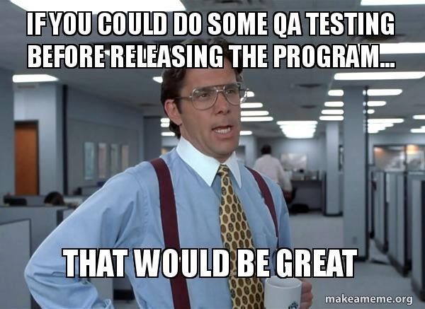

# Testing considered harmful

The majority of material in this book, and definitely in the "Understanding modern test automation practices", should already give you fairly clear advice on what _to actually do_. This page collects some of the things you _shouldn't_ do, inverting the perspective for a moment.

## Over-reliance on QA and/or "over the wall" testing

<figure><figcaption>
Yeah no.
</figcaption></figure>

This scenario is one of the reasons I even took the time to write this book. Don't do this.

Software engineering is a sociotechnical practice – comprised of both social and technical concerns that we need to address throughout our work. While a QA culture fulfills part of the technical requirements we might have, it doesn't fill in the organizational and cultural values we try to reach with ownership of code and quality _within the team_, insistently automating such testing, and making testing an activity that is closely related to the writing of the code itself.


**Solution**

You will probably want to introduce developer-led testing both on the technical level (knowing how it works), the team level (that _we do it together_), as well as on the planning level (making sure testing is a part of definition-of-done and that you as a team take that responsibility).

Perhaps you can also let the QA people you might have worked with either teach your team some tricks of the trade, or they could learn from your work if they are more of manual testers today.


## TDD misinterpretations

Again, I'm not a TDD person myself, though I take a lot of what is said and written as very good guidance and let that influence my own approach. I can easily see how both rabid TDDism or allergic reactions to TDD could haunt even a moderate discussion of moving from "over-the-wall-testing" to more automation. Don't let a developer-led approach to testing be conflated with TDD, which is in the big picture just another approach to getting to the same goal.


**Solution**

Clarify the strategy and approach that you will take in clear terms so everyone knows what to expect in reality in terms of ways of working, tooling, and procedure.


## Too many tests (i.e. redundant tests)

Redundant tests mean that we have several tests covering the same assertion.

At some level, there is sometimes no way to completely get rid of redundancy. For example, in a test suite with 5 individual passing tests, all will likely assert that the class or function itself will run (in the meaning of "start") without crashing. In reality, you have five tests that cover some of the same lines, branches, and statements. They might indeed all do _something_ specific as well, but in terms of ensuring that the hooking-and-wiring is set up, it would be technically correct to call them redundant. Maybe we can call this _functional redundancy_.

Real and painful redundancy however happens at different scales and scopes.


On this theme, consider reading:

* [_Are Your Unit Tests Getting Redundant? Here’s How To Write Them Effectively_](https://betterprogramming.pub/are-your-unit-tests-getting-redundant-heres-how-to-write-them-effectively-a4d98234ec94) by Oliver Spryn
* [_Test Suite and Test Redundancy: How Your Watchmen Have Turned Against You_](https://huddle.eurostarsoftwaretesting.com/common-problems-of-test-redundancy/) by EuroSTAR Huddle


For example, in my project [Figmagic](https://github.com/mikaelvesavuori/figmagic) (started in 2018) I have followed a classic convention in which each class and function gets its own tests. You will see, among others, that Angular enforces this old-school convention. At first blush, this makes sense, as there are not many scenarios in which something does not deserve _some degree_ of testing. But the back side is that we are encouraged to write code that is modular without hierarchy—something that the onion/hexagonal/clean architectures all have tried to address. So, while this is not a "problem" per se, it is something that can lead to redundant tests. In my case with Figmagic, for example, there is quite a bit of unnecessary redundancy because of this approach.


**Solution**

Over time the testing evolved to something closer to what I think is "correct" today. In this newer approach **I will typically write the passing use case tests first of all, since these are the most important tests of all**: without these passing the expected behavior will not manifest itself. Individual functions may work, but the big picture will fail. That's a bad thing.

After these tests, we can investigate the detailed coverage and start smoking out the difference/delta we need to get to 100% coverage. Very often a big set of tests will have to be written, that deal with the failing states. Depending on the rigor of your software architecture you might have a wider surface to cover at the outer scopes (i.e. such as use cases) than on the private methods on an entity (because validation may have occurred in earlier stages).

Writing tests that validate failure states on the use case level may be harder or less intuitive. Instead, we want that detail _on the actual class or function tests_. That's where I would add those tests. So:

* Use cases test for all intended positive states.
* Use cases should test for all reasonable use case-level failure states.
* Individual tests (i.e. per class or function) handle primarily failing states (since positive states should be exercised with the coarser-grained tests coming from the use cases).
* Individual test files may contain additional tests for positive states if those are not easily or intuitively covered from the "outer" use case tests.

Conducting your testing this way ensures we have the right detail in the right locations. It may not come as easily as the more simplistic "just write all the tests in the respective file", but it will certainly minimize redundancy, allow you to run tests where they matter, make you write _fewer_ tests (the exact number of tests is less important than having _confident_ coverage), and therefore leads to a more maintainable stable of tests.


## Too few tests

<figure><figcaption>
Unfortunately not just a meme 🤯
</figcaption></figure>

This one may seem like an oxymoron, as the very intent of this book is to give you practical guidance in writing tests and why you would want to do that. Still, it bears mentioning.

If you are building a basic, non-critical application and have a few (say in the range of a dozen) tests for parts you _know_ are something you need to hold some control over, but your total coverage is, say 40%, then that's totally fine!

Just as stating an absolute limit or expectation on tests and test coverage is hard, so is saying when there are too few of them.

A heuristic is generally more applicable and easier to use. As I wrote on the page about "Confidence-based testing", confidence should be the driving aspect irrespective of any strategy. The more critical your workload is, the more you should also apply Reagan's "[trust but verify](https://en.wikipedia.org/wiki/Trust,\_but\_verify)" attitude. So, in your personal low-criticality app having no or few tests is probably entirely fine, if you feel that you can trust the app to work once it gets deployed. However, in a business environment in which the criticality element is significantly increased the confidence factor becomes a distributed concept that somehow has to be proven to more people than yourself.


**Solution**

In a professional context, the common expectation of code coverage is often for a value over 80%. Beware that code coverage is never _for you_! It's a level of guarantee (for what it's worth) for every stakeholder and user of the application.


## Blind trust in code coverage

Similarly, code coverage can be misleading. Code coverage can be high but misunderstood, such as only looking at line coverage instead of branch coverage or statement coverage which are both more powerful and meaningful factors.

It's also not that hard to fake coverage by not asserting anything, or even more mischievously, having high coverage but not failing CI builds based on such failures.

Code coverage and testing overall is just one angle of the much larger code quality spectrum.


**Solution**

The first thing to do is to ensure that code coverage is accurately reported and that test infrastructure (CI, test scripts, etc) is working as intended so that we can trust the numbers at all. What I am after is not some kind of mechanical failure on part of the tools but rather to ensure tool integrity so no developer has manipulated them as mentioned above.

Secondly, it's worth having a richer strategy for quality that extends beyond (unit?) testing as is implied here. Consider using tooling such as SonarCloud, DeepSource, Codiga, and similar to run deeper and more exhaustive static code analysis.


## Brittle and flaky tests

This is what you end up with if you cannot depend on your tests running or working as intended every time that you start them. Unbelievable as it may sound to someone who hasn't done a fair share of testing in their career, this is quite common it seems, and is one of the first things you should address in there is already test automation but a low trust in the tests.

Personally, I tend to see these tests having one or more of the following properties:

* Async in synchronous contexts
* I/O dependence
* Shared environment conflict (constants, process environment variables...)


**Solution**

Locate the brittle tests and analyze the root cause of the problem. Address it conventionally by code. If it's one of the above, consider building test utility functions like `setEnv()` and `clearEnv()` that are run in lifecycle methods like `beforeEach()` and `afterEach()`.

Generally, you also really don't want to test too much I/O stuff either. While it _can work_ it may be painful and not add meaningful confidence to your tests if you really aren't interested in the exact details of the I/O (which you probably aren't).


## Be overly framework-dependent

Testing tools should be very low on your list of things that are highly customized. Have a transactional, Platonic relationship with your tools—not a love affair. Once you need to cross over to other tools, let it be possible to do so in a very short time (in some hours, not in days or weeks).


**Solution**

Use or migrate to lightweight tooling that uses nomenclature, patterns, and standards that come with less baggage. Consider options like [AVA](https://github.com/avajs/ava) or the [Node 18-native test runner](https://nodejs.org/dist/latest-v18.x/docs/api/test.html#test-runner).

