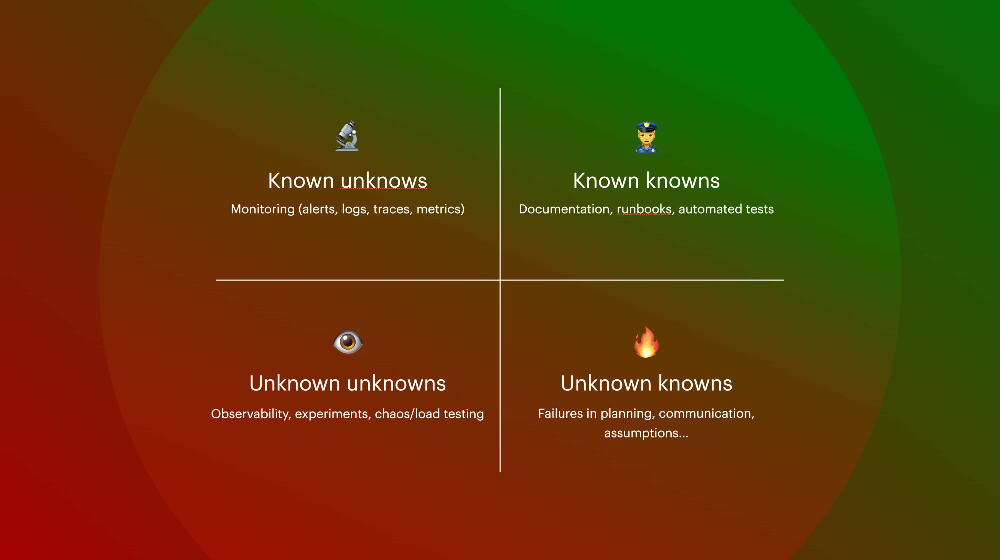
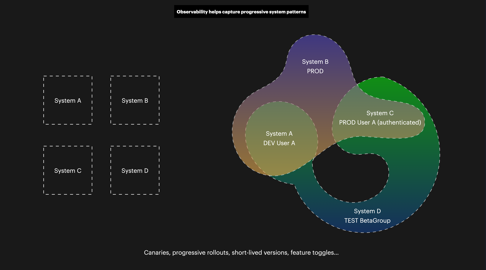

# Testing in production

> We hear “testing in production” and think lack of caution, carelessness, poor engineering.
>
> But in reality, every deploy is a test. In production. **Every user doing something to your site is a test in production.** Increasing scale and changing traffic patterns are a test. In production.
>
> — Charity Majors, [_Testing in Production: Why You Should Never Stop Doing It_](https://www.honeycomb.io/blog/testing-in-production)

It's actually a really intuitive notion. Given that tests are performed on something "known" and often in isolation (despite any misinformed ideas about permanent staging/test/QA environments), they aren't very good at exposing complex issues. Tests are most often intended to prove that a known behavior performs as expected.

But testing, and monitoring, are also about learning about our issues—things we might not know about. In the last chapter, we looked at approaches for selecting a test environment strategy. It should have been clear that I've tried to push you in the direction of more often pushing code, being better tested in isolation, into your actual production environment rather than using pre-production environments.

Given that tests are something that verifies expected functionality, then these run at a single point in time, which is ideally several times between my code being written up until it hits the CI environment and is tested there. **Most of the conventional test types cover the known-known parts of our problem space**. But there is a lot more that could happen...

<figure><figcaption>
How developers can apply correct types of tools and methods for various problem spaces in testing and quality.
</figcaption></figure>

Conventional, "local" tests such as unit tests and (inbound, self-targeting) integration tests, are run close to the code and emit errors or reports that typically a developer will need to decode. The benefit is that these results are exact and actionable. The drawback is that _they are not run after_ the deployment itself, while the code is in production, facing actual traffic and running alongside any number of other services.

A problem is not necessarily always of a class that can be logically caught, it can also be cascading failures, infrastructural failures, or a third party that has updated its behavior in a problematic way since you last deployed. Some problems can't be picked up by testing, testing at the point of deployment, and certainly not only when this is done seldom (a few times per month or even more rarely). To test in production, a part of the secret sauce is to monitor or otherwise have an updated, informed view of the current state of our system.

Remember the temporal divergence between testing and monitoring, and how observability relates to them:

* **Testing** verifies known behaviors at the _point of testing_.
* **Monitoring** gives you eyeballs on the continued state of your software.
* **Observability** is the property that describes whether or not we can know what happens in your code.

<figure><figcaption>
Life in a distributed landscape is not like those square boxes; rather, it's a lot more like on the right. We need to make our systems observable if we are to understand how they truly behave—something we can't forget just because we are writing tests before the fact.
</figcaption></figure>

One way to understand the role of testing in production is to accept that we need better ways to understand our failures, also from the temporal perspective. And like with Agile overall, shortening the feedback loop is a great way to start that journey. Doing production testing in a considered manner is smart, as instead of _ignoring_ all the rich things that happen with your users in your systems, you can do something productive with this information.

> Everything fails, all the time.
>
> — Werner Vogels, Amazon CTO

Every problem or failure has a cost. Make the most of that payment! Cherish the opportunity.

If we've managed to create an agile, fast-learning, left-shifted testing culture, and we've decomplexified our testing and architecture, then learning from production should not be a problem. It's more of a cultural change once you are at that point. The fear many seem to have is that production is messy, irrational, illogical, and to be feared. Given that you prune your garden, as it were, the number of those odd things in production should decrease and you can gradually control it better and make positive changes in a faster, less painful cycle.


A related option, discussed later, that provides a different value proposition is the _synthetic testing_ approach. In this approach, instead of simply verifying functionality here and now (in isolation), we do it continuously, sometimes upwards of once every minute or even more frequently, using robot/synthetic traffic.

Typically this is done with some type of tooling, rather than being just a basic cronjob. Some off-the-shelf options include conventional monitoring like [Datadog](https://www.datadoghq.com/product/synthetic-monitoring/), dedicated SaaS like [Checkly](https://www.checklyhq.com), or even a provided hyper-scaler option like [AWS CloudWatch Synthetics](https://docs.aws.amazon.com/AmazonCloudWatch/latest/monitoring/CloudWatch\_Synthetics\_Canaries.html). And because these tests no longer just "check" whether the deterministic functionality is correct or not, we are actually not really talking about just "tests" any longer.

I'd recommend this type of tooling primarily if you have very low or sporadic traffic, as you can catch the same issues with real production traffic.


Charity Majors, one of the big proponents of testing in production, writes how there are multiple actionable paths for developers once they've grown accustomed to what production should look like:

> **Everyone should know what a normally-operating system looks like, and how to debug basic problems. This should not be a rare occurrence.**
>
> If you test in production, it won’t be. I’m talking about things like “does this have a memory leak?” Maybe run it as a canary on five hosts overnight and see. “does this functionality work as planned?” At some point, just ship it with a feature flag so only certain users can exercise it. Stuff like that. Ship it and see. \[...]
>
> You’re shipping code every day and causing self-inflicted damage on the regular, and you can’t tell what it’s doing before, during or after. It’s not the breaking shit that’s the problem: you can break things safely, it’s the second part that’s not ok. Your bigger problem can be addressed by:
>
> * Canarying. Automated canarying. Automated canarying in graduated levels with automatic promotion. _Multiple canaries in simultaneous flight_!
> * Making your deploys more automated and robust, and faster in general (5 min upper bound is good)
> * Making rollbacks wicked fast and reliable.
> * Instrumentation, observability, early warning signs for staged canaries. End to end health checks of key endpoints.
> * Choosing good defaults. Feature flags. Developer tooling.
> * Educating, sharing best practices, standardizing practices, making the easy/fast way the right way.
> * Taking as much code and as many backend components as possible out of the critical path. Limiting the blast radius of any given user or change.
> * Exploring production, verifying that the expected changes are what actually happened, understanding what normal looks like.
>
> These things are all a _great_ use of your time. Do those things.
>
> — Charity Majors, [_Testing in Production: Why You Should Never Stop Doing It_](https://www.honeycomb.io/blog/testing-in-production)

With that long quote, I also want to mention that quality is never just the engineer's job.

This approach, and its heavy dependence on proactive monitoring connected to any failure/bad states, are not just technical means—they are sociotechnical in nature. Just buying a tool or wiring your code to be 100% observable, but lacking procedure and culture, won't solve your problems. Sorry.
