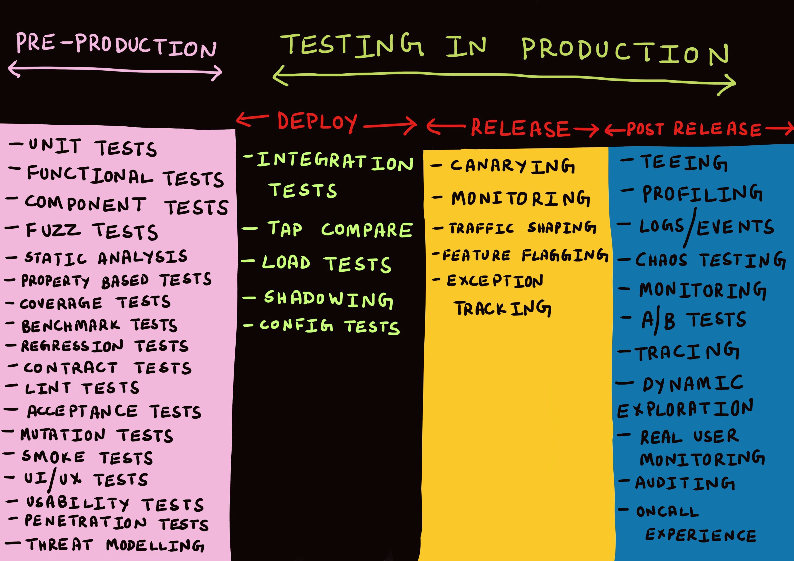

# Types of testing

> **It is impossible to test absolutely everything**, without the tests being as complicated and error-prone as the code. It is suicide to test nothing (in this sense of isolated, automatic tests). So, of all the things you can imagine testing, what should you test?
>
> **You should test things that might break**. If code is so simple that it can't possibly break, and you measure that the code in question doesn't actually break in practice, then you shouldn't write a test for it...
>
> **Testing is a bet**. The bet pays off when your expectations are violated \[when a test that you expect to pass fails, or when a test that you expect to fail passes]... So, if you could, you would only write those tests that pay off. Since you can't know which tests would pay off (if you did, then you would already know and you wouldn't be learning anything), you write tests that might pay off. **As you test, you reflect on which kinds of tests tend to pay off and which don't, and you write more of the ones that do pay off, and fewer of the ones that don't**.
>
> — Kent Beck: [_Extreme Programming Explained_](https://www.goodreads.com/en/book/show/67833.Extreme\_Programming\_Explained)

> \[...W]hen anyone starts talking about various testing categories, dig deeper on what they mean by their words, as they probably don't use them the same way as the last person you read did.
>
> — Martin Fowler, [_On the Diverse And Fantastical Shapes of Testing_](https://martinfowler.com/articles/2021-test-shapes.html)

There are several dozens of testing types that you could painstakingly perform. Even worse, it's not uncommon to find contention around the exact terms and meanings of them! So, yeah, testing has grown into a minefield. Just like with code itself, tests can be done in so many different ways, shapes, and forms that finding what tends to "pay off", as Beck wrote, can be quite the gamble.

## Why so many types of testing?

Tests are instruments to validate (assert) hypotheses about the expected behavior of our software. Given that software is complex, changing over time, multi-modal, multi-platform, and doesn't have generically applicable standards the same way we could expect of many other industries or professions, we end up with a huge array of testing types.

Further impacting the situation is that test tooling has to adapt based on whether or not we can (and want to) allow testing of the source code, or if the testable source is happening from (for example) the user interface. So, while a test may often be performed in several ways, there is an obligation on us to make a wide and informed "cut" across which testing types should be considered for a given system. The occurrence of a specific sort of test will depend on your use case; a backend will not need a visual test, however, the frontend using said backend will certainly want to test against it (since it “consumes” its services). Factors we might want to consider when choosing testing types are:

* **What** can I access (the code, the UI, something else)?
* **When** do I run the test?
* **Where** do I run the test?
* **How** do I run the test?
* **How** **frequently** do I run the test?
* **Why** is this the best testing type for my need?

If I had been a smarter person I would have a diagram tying it all together... Luckily, for our intents and purposes, we can just pop up Cindy Sridharan's illustration of some of these techniques and how they stack across an application lifecycle and use that as starting point:

<figure><figcaption>
From <a href="https://copyconstruct.medium.com/testing-in-production-the-safe-way-18ca102d0ef1">Testing in Production, the safe way</a>
</figcaption></figure>

What I love about the diagram is that it puts the temporal (i.e. time) perspective on top of all the test types. Not all testing types are made equal, and they have their place in different parts of the lifecycle; some are great at finding errors in a known context (linters, compilers) while some tooling will never be meaningful _before the fact_ (monitoring, tracing, load tests). This is a good thing, as we can reduce the mass of types into something much more manageable.

## The purpose of a test

Every testing type has a _purpose_. While that may sound self-evident, I do believe that many miss this point in actuality. If something has a purpose, it must be ideal to use that thing (testing type) for that specific purpose, wouldn't you say? Let me give you a bad example of this: It's not uncommon for developers to love the idea of integration tests and start writing them and making them validate the business logic of the tested system. Why on earth would you do that?

* The integration test's purpose is to _ensure the integration between points A and B works_. This test does something much more detail-oriented.
* The integration test is _outside the code scope of the system under test_ and is therefore in effect a _third party_—you don't test third-party code.
* The business logic (or similar) should be validated by one part only, the system itself. This is because the misguided attempt is fundamentally about completing a _logical assertion_‚ not doing an infrastructural test.
* Clearly, the purpose of the test is misguided and unit tests might serve as a better option. If deemed important enough, perhaps the integration test could be reduced and simplified and kept as a set of "smoke tests" to ensure typical valid cases send back the correct status code. Now we are coming closer to the purpose of each test.


**Push tests "to the left"**

An argument I have made, and will continue making, is that we need to start pushing our tests "to the left", meaning we should get developers to write them and overall go for "simpler tests" (such as unit testing and static testing). The vast majority of needs you have when building a piece of software are about the software and its logic and much less about infrastructural concerns.


## What to focus on

From the above, the ones I think you should know _well_ are:

* **Static analysis**: Under this broad term **lint testing** can also be considered a part,
* **Unit testing**: A concept that should by itself include **coverage/functional/component/regression** tests from the above table,
* **Integration testing**: Also known as **API testing**.

These following, additional ones I wouldn't strictly call _necessary_ in the same way as the first ones, but they all still provide useful value for special cases:

* Contract testing
* Smoke testing
* Synthetic testing
* Load testing
* System testing
* End-to-end testing (tested through the UI)

Again, all of the above will be covered in the `Running tests in practice` section.

## Does anyone actually run all those tests?

With "anyone" I feel confident to say that highly tech-oriented organizations definitely seem to run a very rich set of tests. If you think about it, for an organization like Google or Spotify it would make a lot of sense to run the majority of tests you saw in the table.

Do any of the places I've worked at have such rigorous schemes? No. I guess that would go for probably most companies or organizations.

Should _you_ run all types of tests? No. Run what makes sense. Also, remember that different parts of your technical landscape may have different ideal testing schemes.

However, with this said, the top three ones—unit testing, integration or API testing, and static code analysis—should be around without exception. Their relative simplicity, ease of execution, and high-value-low-effort touch make them brilliant in any scenario where you have direct source code access.

## Pre-production testing vs production testing

Another effect I am seeing _a lot_ more pronounced in tech-heavy companies are the mature and rich practices used for "testing in production". I've yet to actually work in a company that does this at any mature level.

We will look at testing in production later in this chapter, but the takeaway here and now is that despite your best intentions, tests won't ever cover all the potential issues your software might run into. Modern systems, running in distributed landscapes, across an almost magical ecosystem of technologies, are fantastic in many ways; but that magic is frail. Testing in production is a reality check that conventional testing is first and foremost about the known states of your software and that a different toolbox is needed for the unknown things—which will not happen in your pre-production environment but typically inflicts itself on customers in your production environment. Hence the name.

More on this later.

## In closing

We've raced into the great big area of testing and also taken in a few different practical notions that can guide us later:

* All types of tests have a temporal place in a lifecycle.
* What tests make sense in a given case is context-dependent.
* Every test type has a purpose and a part of your job is to apply the best type of test to each need.
* We need to accept that tests are pretty much only about that which we know, so we need other tools for the unknowns.

Next up, we will discuss testing models.
